# Findings by Municipality — Source-Traceable Detail

Per-municipality detail for all 12 towns. Each field is marked **clean**, **buried**, **none**, or **n/a**:
- **clean** — published in a ready-to-use form (a text PDF or a web table a computer can read directly).
- **buried** — it's published, but stuck in a *scanned image* (a photo of the page, so it needs OCR to read) or it isn't stated outright and has to be pieced together from other numbers.
- **none** — not published / not recorded at all.
- **n/a** — doesn't apply to this town (e.g., cities don't hold town meeting).

Every figure links to its exact source, with a screenshot where the site allowed one.

Sample = 12 municipalities spanning population 1,931 → 155,929, both government forms, 6 counties incl. rural west, and the main website platforms. Newton & Amherst are **calibration** munis (already in the Lab's dataset — re-found independently to validate the method).

---

## Newton — 88,923 · Middlesex · City (Mayor + 24-member Council) · Granicus

**Election content:** https://www.newtonma.gov/government/elections/election-results (year-folder structure back to pre-2010) · **Calibration: all 3 known records re-found and MATCH exactly** (2021: 20,431/63,120 ✓; 2023: 16,655/59,654 ✓; 2019: 15,432/60,630 ✓).

| # | Data point | Score | Latest value | Source |
|---|-----------|-------|--------------|--------|
| 1 | Registered/eligible voters | clean | 62,033 (2024); 63,120 (2021) | [2021 results p5](https://www.newtonma.gov/home/showpublisheddocument/76991/637848578455170000#page=5) |
| 2 | Local election turnout | clean | 20,431 (2021) | same PDF, summary page |
| 3 | State election turnout | clean | 2022/2024 folders | election-results page |
| 4 | Federal/presidential turnout | clean | 46,770/62,033 = 73% (2024) | State Election PDF + [Newton Beacon](https://www.newtonbeacon.org/by-the-numbers-how-newton-voted-in-the-2024-election/) |
| 5 | Town Meeting attendance | n/a | — | city, no town meeting |
| 6 | Special Town Meeting attendance | n/a | — | city, no town meeting |
| 7 | Seats on ballot | clean | 16 Councilor-at-Large + 8 Ward + 8 School Cmte (2023) | results PDF office row-groups |
| 8 | Unopposed / none-running | buried | 9 councilors unopposed (2023) | derive from ballot PDF; or [Fig City News](https://figcitynews.com/2023/11/six-new-councilors-elected-three-incumbents-ousted/) |
| 9 | Incumbents running | buried | not flagged in PDF | cross-ref prior roster / local news |
| 10 | Office type + term length | clean | Council 2yr; School 2yr; Mayor 4yr | [Running for Office](https://www.newtonma.gov/government/elections/running-for-office) |

⚠️ **Access:** all `showpublisheddocument` PDFs sit behind **Akamai** bot-protection — plain curl/WebFetch get HTTP 403; a real browser or full client-hint headers work. Also a **format inconsistency**: 2019 & 2021 results are searchable text, but **2023 is a scanned image (OCR needed)** — a scraper must branch text-vs-OCR per document.

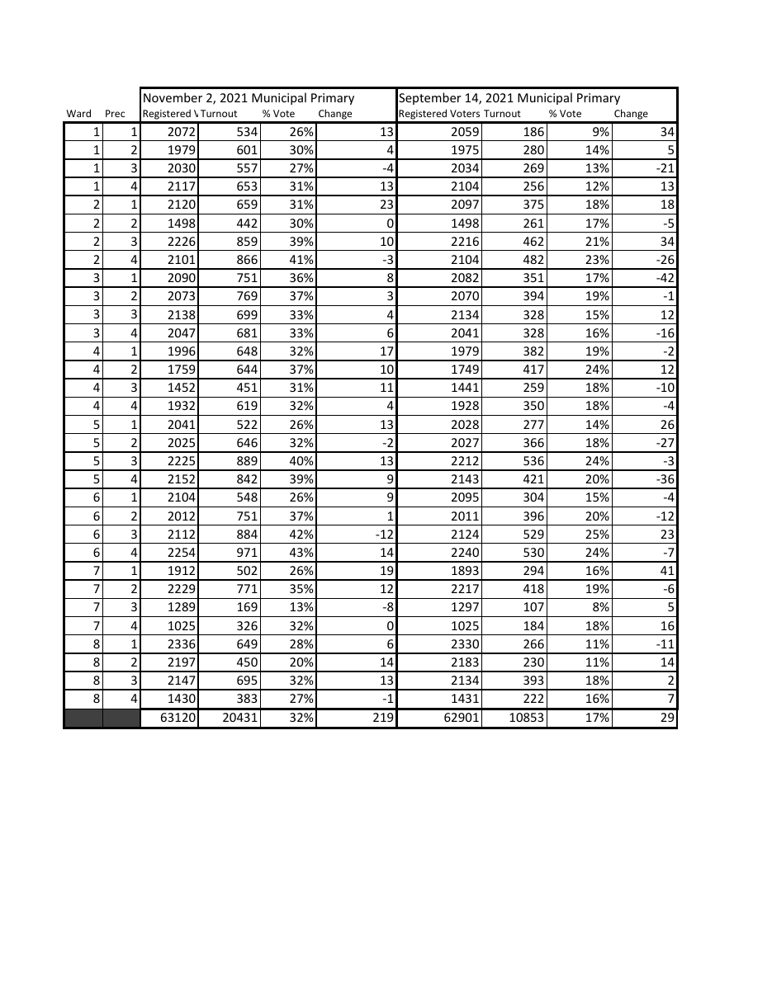
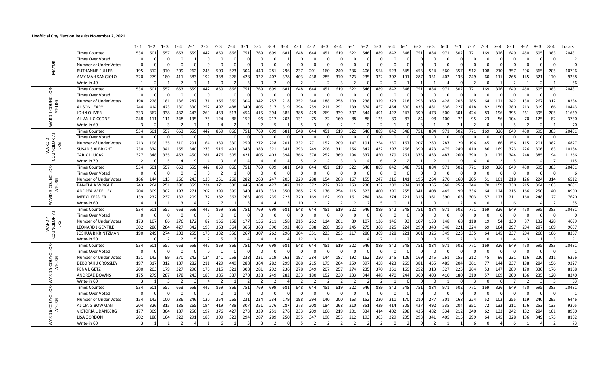
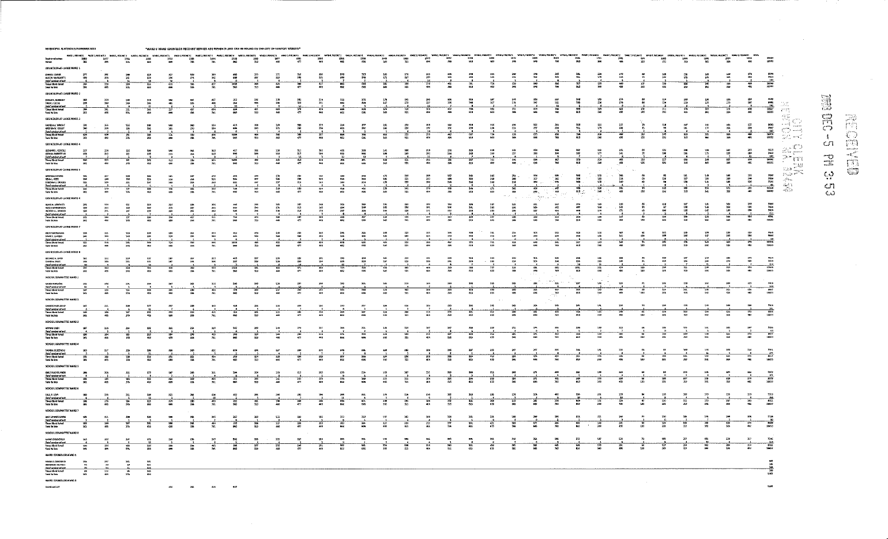
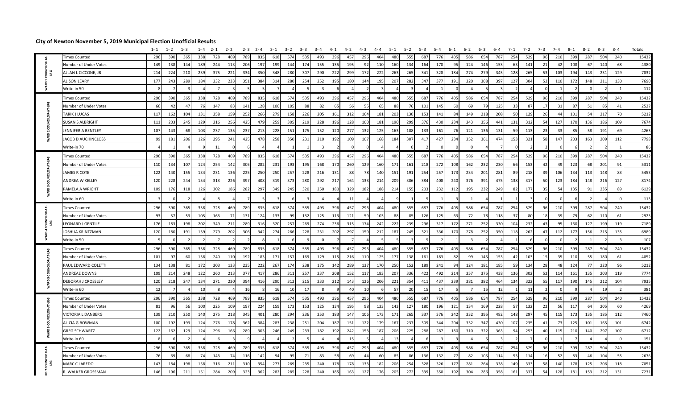

---

## Amherst — Hampshire · Town-Council (council-manager since 2018, no town meeting) · CivicPlus

**Election content:** https://www.amherstma.gov/650/Upcoming-and-Past-Election-Information (clean per-election index) · **Calibration: all 3 known records MATCH exactly** (2023: 4,480/13,700 ✓; 2021: 5,043/16,187 ✓; 2019: 2,371/17,269 ✓).

| # | Data point | Score | Latest value | Source |
|---|-----------|-------|--------------|--------|
| 1 | Registered/eligible voters | clean | 13,803 (2025) | [2025 turnout #p1](https://www.amherstma.gov/DocumentCenter/View/83342#page=1) |
| 2 | Local election turnout | clean | 3,881 cast = 28.12% (2025) | [2025 turnout](https://www.amherstma.gov/DocumentCenter/View/83342#page=1) |
| 3 | State election turnout | clean | 10,743/14,704 = 73% (2024) | [2024 state turnout](https://www.amherstma.gov/DocumentCenter/View/75557) |
| 4 | Federal/presidential turnout | clean | 11,913/16,572 = 72% (2020) | [2024 state turnout](https://www.amherstma.gov/DocumentCenter/View/75557) (MA folds pres. into Nov general) |
| 5 | Town Meeting attendance | n/a | — | council form |
| 6 | Special Town Meeting attendance | n/a | — | council form |
| 7 | Seats on ballot | clean | 28 seats / 10 office groups (2025) | [2025 results](https://www.amherstma.gov/DocumentCenter/View/83343) · [warrant](https://www.amherstma.gov/DocumentCenter/View/81078) |
| 8 | Unopposed / none-running | buried | District 5 unopposed; Housing Auth. undersubscribed | derive: candidates vs seats |
| 9 | Incumbents running | buried | not flagged; warrant lists 13 sitting councilors | cross-ref warrant signatories |
| 10 | Office type + term length | clean | all offices "2 YEARS" (printed in warrant) | [warrant table](https://www.amherstma.gov/DocumentCenter/View/81078) |

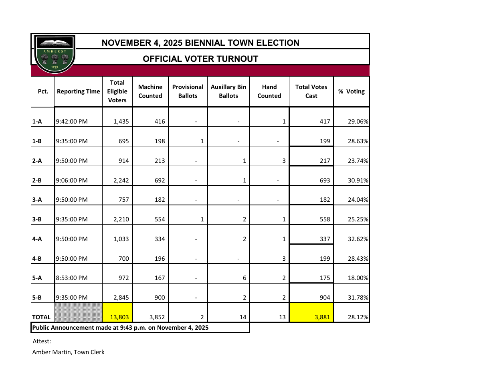
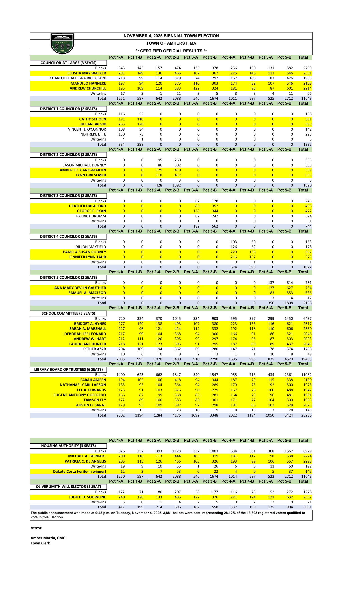
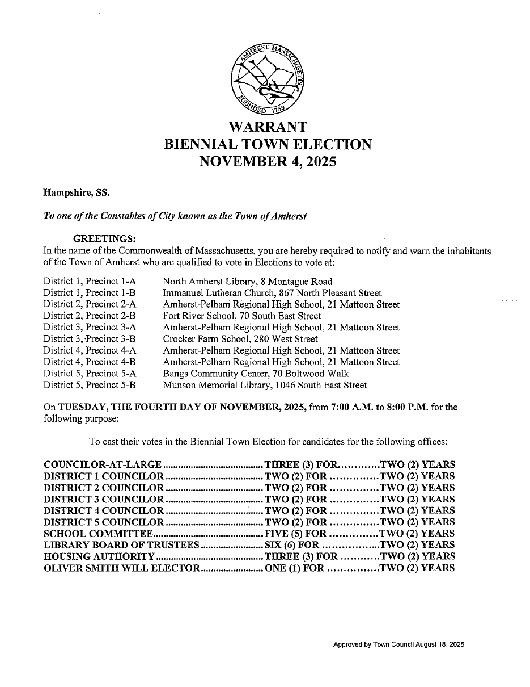
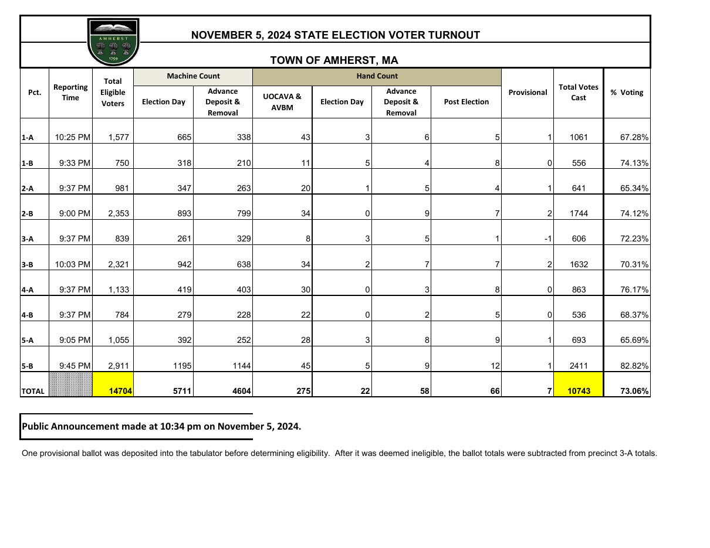
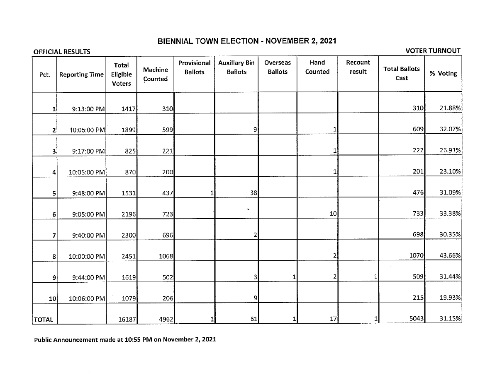

---

## Cambridge — 118,403 · Middlesex · City (Council-Manager, PR/ranked-choice) · Custom + Socrata

**Election content:** https://www.cambridgema.gov/departments/electioncommission/electionresults + open-data "Voter Turnout 1999–Present" https://data.cambridgema.gov/d/4bq3-vfga

| # | Data point | Score | Latest value | Source |
|---|-----------|-------|--------------|--------|
| 1 | Registered/eligible voters | clean | 74,825 (2024); 69,849 (2023) | [2023 turnout #p1](https://www.cambridgema.gov/-/media/Files/electioncommission/2023municipalelection/mun2023voterturnout.pdf#page=1) |
| 2 | Local election turnout | clean | 23,512 = 34% (2023) | [2023 turnout](https://www.cambridgema.gov/-/media/Files/electioncommission/2023municipalelection/mun2023voterturnout.pdf#page=1) |
| 3 | State election turnout | clean | 50,661 = 68% (2024) | [2024 turnout](https://www.cambridgema.gov/-/media/Files/electioncommission/2024presidentialgeneral/november52024turnout.pdf#page=1) |
| 4 | Federal/presidential turnout | clean | 74,825 reg / 50,661 cast (2024) | [2024 turnout](https://www.cambridgema.gov/-/media/Files/electioncommission/2024presidentialgeneral/november52024turnout.pdf#page=1) |
| 5 | Town Meeting attendance | n/a | — | city |
| 6 | Special Town Meeting attendance | n/a | — | city |
| 7 | Seats on ballot | clean | 9 Council + 6 School (charter-fixed) | [2023 council totals](https://www.cambridgema.gov/Election2023/Official/Council%20Round.htm) |
| 8 | Unopposed / none-running | clean | 0 (24 candidates / 9 seats) | structurally N/A under PR |
| 9 | Incumbents running | buried | 6 incumbents re-ran (2023) | not flagged; join to prior winners |
| 10 | Office type + term length | clean | Council & School both 2yr | results pages + charter |

ℹ️ **Ranked-choice note:** Cambridge uses single-transferable-vote PR — one at-large multi-seat contest per body reported as 16 transfer rounds. "Seats on ballot" is charter-fixed and "unopposed" is structurally meaningless; researchers must plan for the round-by-round result shape. Socrata API gives clean CSV for 1999–2016; 2017→present is in the per-election PDFs.

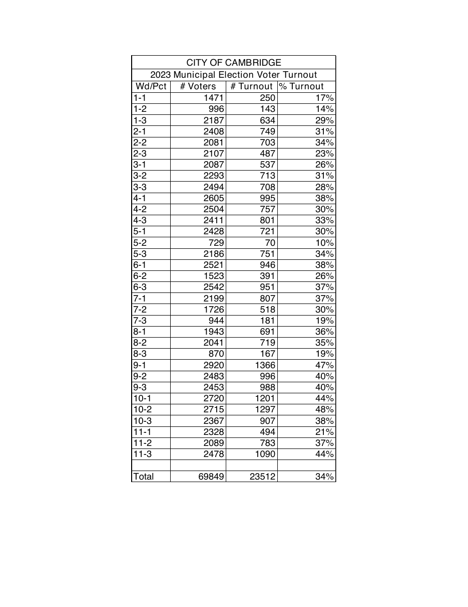
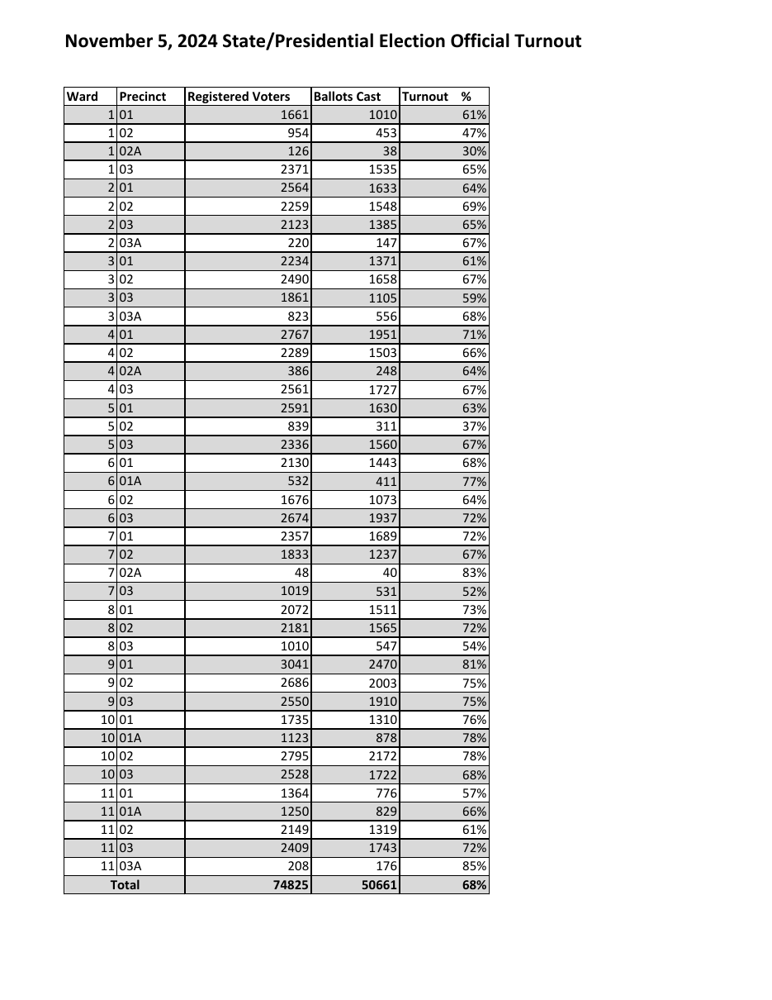
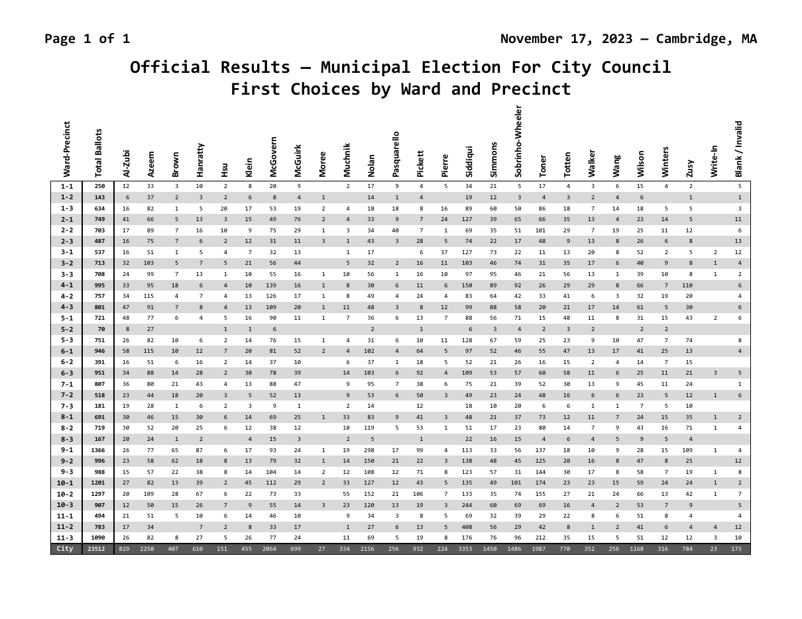

---

## Springfield — 155,929 · Hampden · City · TYPO3 (HTML results)

**Election content:** https://www.springfield-ma.gov/elections/ (canonical domain; `springfieldcityhall.com` redirects here) · results are clean selectable **HTML `<PRE>` text tables** — no PDF, no OCR, no gating.

| # | Data point | Score | Latest value | Source |
|---|-----------|-------|--------------|--------|
| 1 | Registered/eligible voters | clean | 122,724 (2025) | [votecounts.php](https://www.springfield-ma.gov/elections/votecounts.php) ("REGISTERED VOTERS - TOTAL") |
| 2 | Local election turnout | clean | 13,100 = 10.67% (2025 city general) | [votecounts.php](https://www.springfield-ma.gov/elections/votecounts.php) |
| 3 | State election turnout | clean | 28,795 = 24.88% (2022) | [2022 results](https://www.springfield-ma.gov/elections/past-elections/november-8-2022-election-results) |
| 4 | Federal/presidential turnout | clean | 51,370 = 43.57% (2024) | [2024 results](https://www.springfield-ma.gov/elections/past-elections/november-5-2024-election-results) |
| 5 | Town Meeting attendance | n/a | — | city |
| 6 | Special Town Meeting attendance | n/a | — | city |
| 7 | Seats on ballot | clean | 19 seats (2025); each race "(VOTE FOR) N" | [votecounts.php](https://www.springfield-ma.gov/elections/votecounts.php) |
| 8 | Unopposed / none-running | clean | 4 council/school seats unopposed (2025) | [votecounts.php](https://www.springfield-ma.gov/elections/votecounts.php) |
| 9 | Incumbents running | buried | not in results doc | join winner lists across cycles |
| 10 | Office type + term length | clean | Council 2yr (13); School 4yr (6); Mayor 4yr | results + [Charter](https://ecode360.com/14659280) |

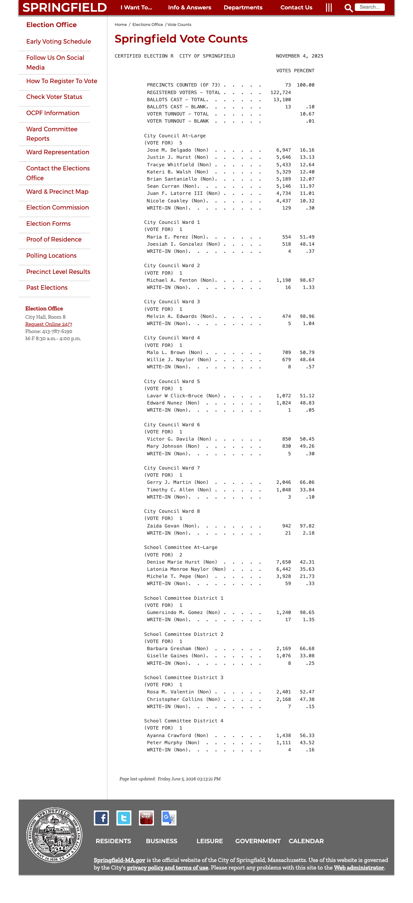
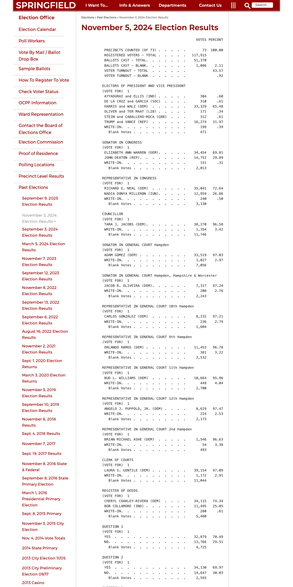

---

## Framingham — 72,362 · Middlesex · City (since 2018) · CivicPlus

**Election content:** https://www.framinghamma.gov/3095/Election-Results · document format stayed consistent across the 2018 town→city transition.

| # | Data point | Score | Latest value | Source |
|---|-----------|-------|--------------|--------|
| 1 | Registered/eligible voters | clean | 42,090 (2025); 43,783 (2024) | [2025 results #p3](https://www.framinghamma.gov/DocumentCenter/View/54422/Official-results-11042025#page=3) |
| 2 | Local election turnout | clean | 9,689 ≈ 23% (2025) | [2025 results #p3](https://www.framinghamma.gov/DocumentCenter/View/54422/Official-results-11042025#page=3) |
| 3 | State election turnout | clean | 30,134/43,783 (2024) | [2024 state #p2](https://www.framinghamma.gov/DocumentCenter/View/53070#page=2) |
| 4 | Federal/presidential turnout | clean | 30,134 (2024) | [2024 state #p2](https://www.framinghamma.gov/DocumentCenter/View/53070#page=2) |
| 5 | Town Meeting attendance | n/a | — | city since 2018 |
| 6 | Special Town Meeting attendance | n/a | — | city since 2018 |
| 7 | Seats on ballot | clean | Mayor + 9 District Council + 9 District School (2025) | [2025 results #p1](https://www.framinghamma.gov/DocumentCenter/View/54422/Official-results-11042025#page=1) |
| 8 | Unopposed / none-running | clean | Districts 1,5,6,7 unopposed (2025) | derive from candidate rows |
| 9 | Incumbents running | buried | names present, not flagged | cross-ref roster /2703 |
| 10 | Office type + term length | clean | Mayor "for 4 years"; Council "for 2 years" — **printed inline** | [2025 results #p1](https://www.framinghamma.gov/DocumentCenter/View/54422/Official-results-11042025#page=1) |

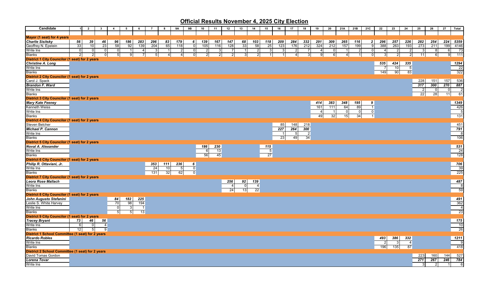
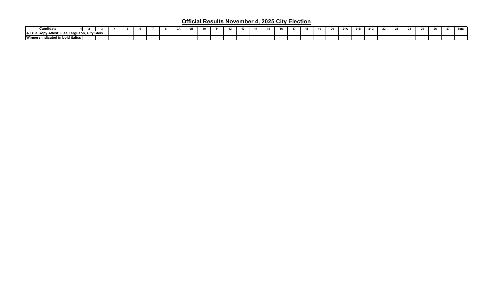
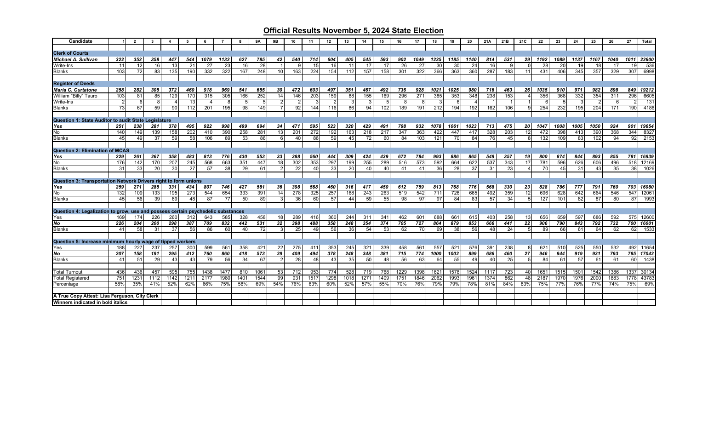

---

## Acton — 24,021 · Middlesex · Open Town Meeting · CivicPlus

**Election content:** https://www.acton-ma.gov/598/Elections-Voting · Town Meeting results archive AMID=55. **Town-meeting attendance is recorded on a labeled header line** ("NUMBER OF REGISTERED VOTERS ATTENDING TOWN MEETING").

| # | Data point | Score | Latest value | Source |
|---|-----------|-------|--------------|--------|
| 1 | Registered/eligible voters | clean | 16,243 (2025) | [2025 results #p1](https://www.actonma.gov/DocumentCenter/View/10630#page=1) |
| 2 | Local election turnout | clean | 2,230 = 13.73% (2025) | [2025 results #p1](https://www.actonma.gov/DocumentCenter/View/10630#page=1) |
| 3 | State election turnout | clean | State archive | [AMID=81](https://acton-ma.gov/Archive.aspx?AMID=81) |
| 4 | Federal/presidential turnout | clean | State (Presidential) archive | [AMID=81](https://acton-ma.gov/Archive.aspx?AMID=81) |
| 5 | **Town Meeting attendance** | clean | **2,579 (May 6) / 502 (May 7) 2024** | [2024 ATM abstract #p1](https://www.actonma.gov/ArchiveCenter/ViewFile/Item/20649#page=1) |
| 6 | **Special Town Meeting attendance** | clean | **364 (Nov 25 2024 STM)** | [2024 STM summation #p1](https://www.actonma.gov/ArchiveCenter/ViewFile/Item/21189#page=1) |
| 7 | Seats on ballot | clean | Moderator, Select Bd, School, Library, Water, Housing | [2025 results](https://www.actonma.gov/DocumentCenter/View/10630#page=1) |
| 8 | Unopposed / none-running | clean | Moderator, Library, Housing unopposed (2025) | derive from candidate rows |
| 9 | Incumbents running | buried | not labeled | cross-ref prior officeholders |
| 10 | Office type + term length | clean | Select Bd 3yr; Moderator 1yr; Housing 5yr | [Elections page](https://www.acton-ma.gov/598/Elections-Voting) |

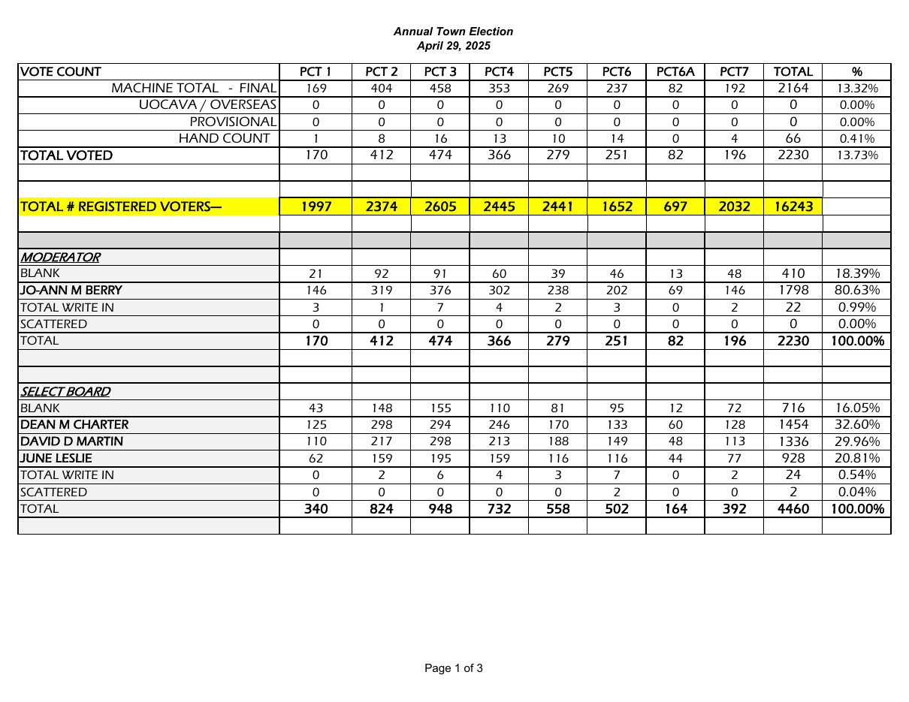
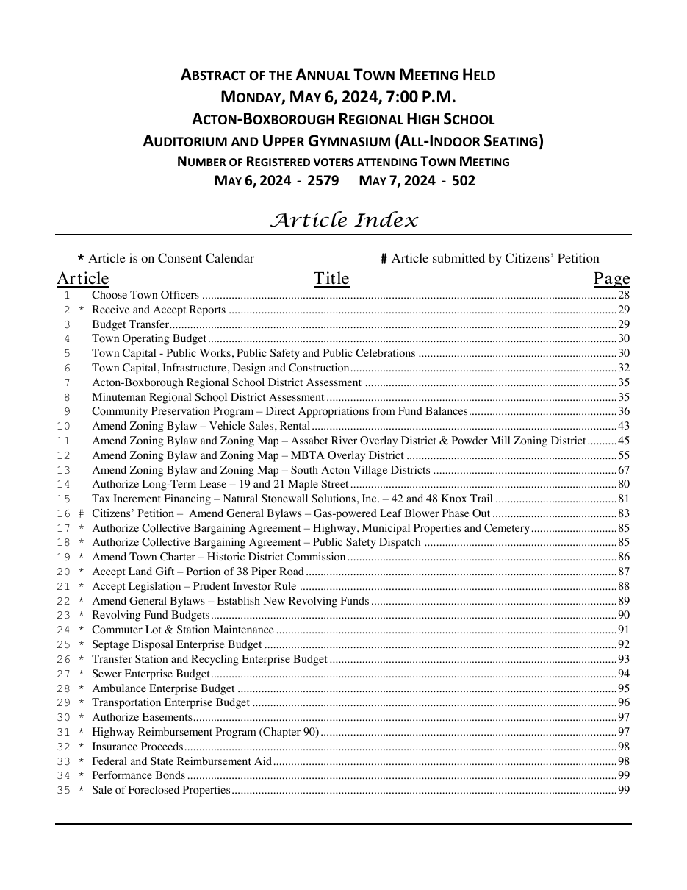
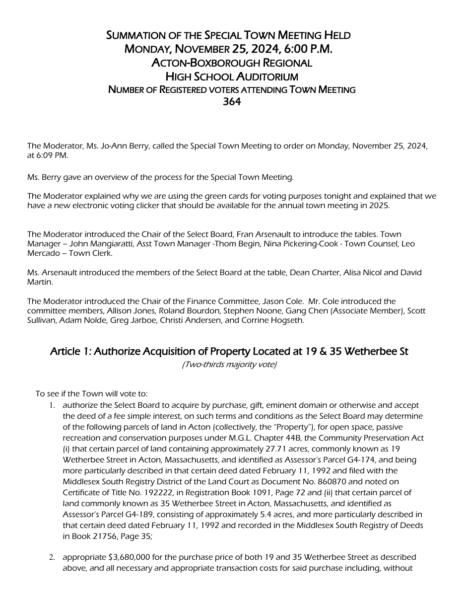

---

## Hingham — 24,284 · Plymouth · Open Town Meeting · CivicPlus  ⭐ best case

**Election content:** https://www.hingham-ma.gov/413/Ballots-Warrants-Results · **the only muni where the ballot explicitly flags incumbents** ("Candidate for Re-election") and prints term length per office; town-meeting attendance is an explicit "Attendance:" line.

| # | Data point | Score | Latest value | Source |
|---|-----------|-------|--------------|--------|
| 1 | Registered/eligible voters | clean | 19,560 (2024) | [Annual Report #p28](https://www.hingham-ma.gov/Archive/ViewFile/Item/1358#page=28) |
| 2 | Local election turnout | clean | 2,205 ≈ 11% (2024) | [2024 results](https://www.hingham-ma.gov/DocumentCenter/View/20235/2024-Town-Election-Results) |
| 3 | State election turnout | clean | 15,849 top contest (2024) | [2024 state](https://www.hingham-ma.gov/DocumentCenter/View/22280) |
| 4 | Federal/presidential turnout | clean | Harris 10,065 / Trump 5,092 (2024); 2020 also itemized | [2020 pres](https://www.hingham-ma.gov/DocumentCenter/View/11059) |
| 5 | **Town Meeting attendance** | clean | **720 (ATM Apr 2024)**; 1,377 (2023) | [Annual Report #p28](https://www.hingham-ma.gov/Archive/ViewFile/Item/1358#page=28) |
| 6 | **Special Town Meeting attendance** | clean | **1,378 (2022 STM)** | [2022 STM results](https://www.hingham-ma.gov/1012/2022-Special-Town-Meeting-Results) |
| 7 | Seats on ballot | clean | 12 seats / 11 offices (2024) | [2024 ballot](https://www.hingham-ma.gov/DocumentCenter/View/20061/2024-Town-Election-Ballot) |
| 8 | Unopposed / none-running | clean | all 2024 races uncontested | [2024 ballot](https://www.hingham-ma.gov/DocumentCenter/View/20061/2024-Town-Election-Ballot) |
| 9 | **Incumbents running** | clean | **10 flagged "Candidate for Re-election" (2024)** | [2024 ballot](https://www.hingham-ma.gov/DocumentCenter/View/20061/2024-Town-Election-Ballot) |
| 10 | Office type + term length | clean | printed per office: 1yr / 3yr / 5yr | [2024 ballot](https://www.hingham-ma.gov/DocumentCenter/View/20061/2024-Town-Election-Ballot) |

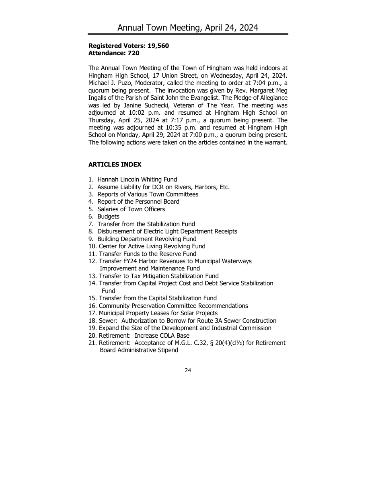
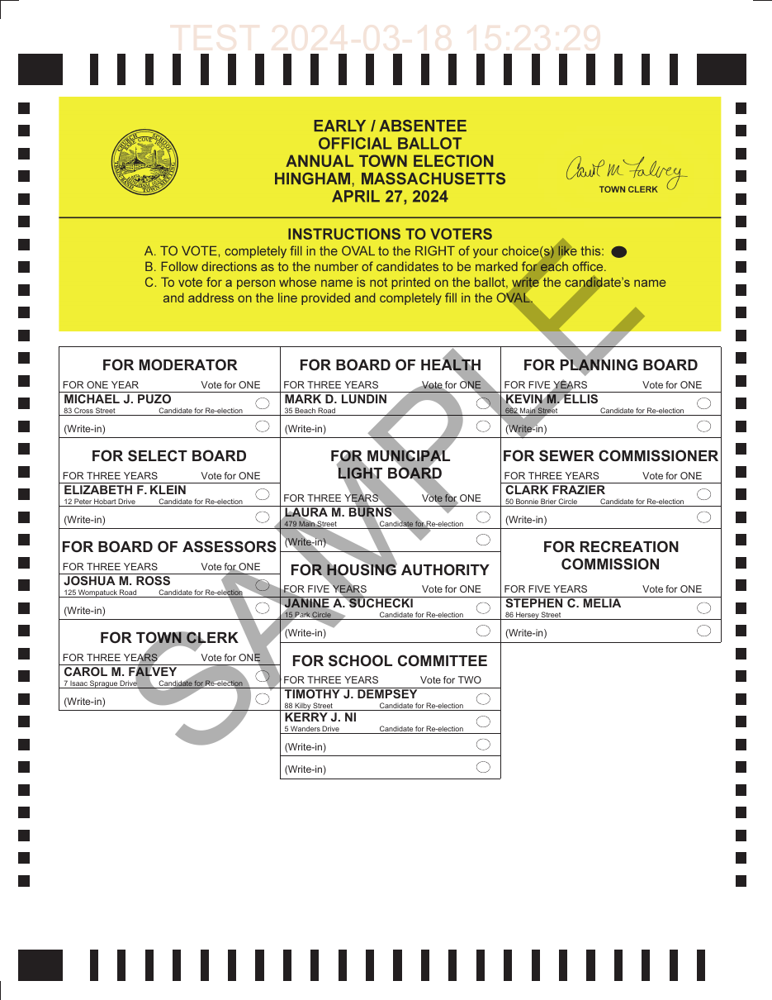
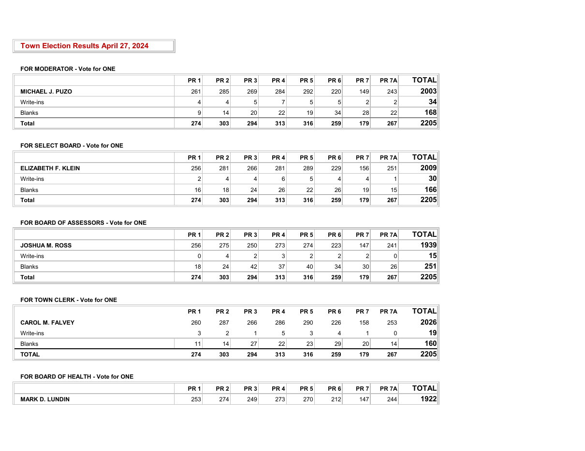
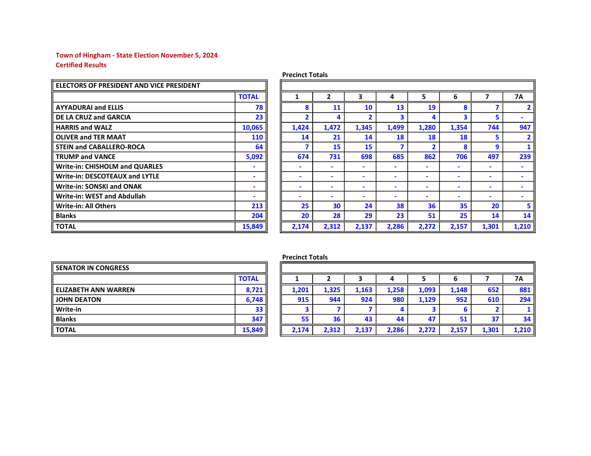

---

## Southwick — 9,232 · Hampden (west) · Open Town Meeting · CivicPlus  ⭐ best case

**Election content:** https://www.southwickma.gov/257/Elections-Archive · **explicit "Inc." column** marks incumbents; term length under every office; "Doings" docs record town-meeting attendance + quorum.

| # | Data point | Score | Latest value | Source |
|---|-----------|-------|--------------|--------|
| 1 | Registered/eligible voters | clean | 7,736 (2025) | [2025 results #p3](https://www.southwickma.gov/DocumentCenter/View/4447#page=3) |
| 2 | Local election turnout | clean | 947 = 12.24% (2025) | [2025 results #p3](https://www.southwickma.gov/DocumentCenter/View/4447#page=3) |
| 3 | State election turnout | clean | per-precinct (2022) | [View/4468](https://www.southwickma.gov/DocumentCenter/View/4468) |
| 4 | Federal/presidential turnout | clean | 5,768 ballots (2020) | [View/4470](https://www.southwickma.gov/DocumentCenter/View/4470) |
| 5 | **Town Meeting attendance** | clean | **≈604 in attendance (ATM 5/20/2025)** | [ATM Doings #p1](https://www.southwickma.gov/DocumentCenter/View/2622#page=1) |
| 6 | **Special Town Meeting attendance** | clean | **126 checked in (quorum 25), STM 1/14/2025** | STM Doings (ArchiveCenter ADID=335) |
| 7 | Seats on ballot | clean | ~13 offices (2025) | [2025 results](https://www.southwickma.gov/DocumentCenter/View/4447) |
| 8 | Unopposed / none-running | clean | derivable from candidate blocks | [2025 results](https://www.southwickma.gov/DocumentCenter/View/4447) |
| 9 | **Incumbents running** | clean | **"Inc." column with "X"** | [2025 results](https://www.southwickma.gov/DocumentCenter/View/4447) |
| 10 | Office type + term length | clean | "SELECT BOARD / 3 YEARS", "PLANNING / 4 YEARS"… | [2025 results](https://www.southwickma.gov/DocumentCenter/View/4447) |

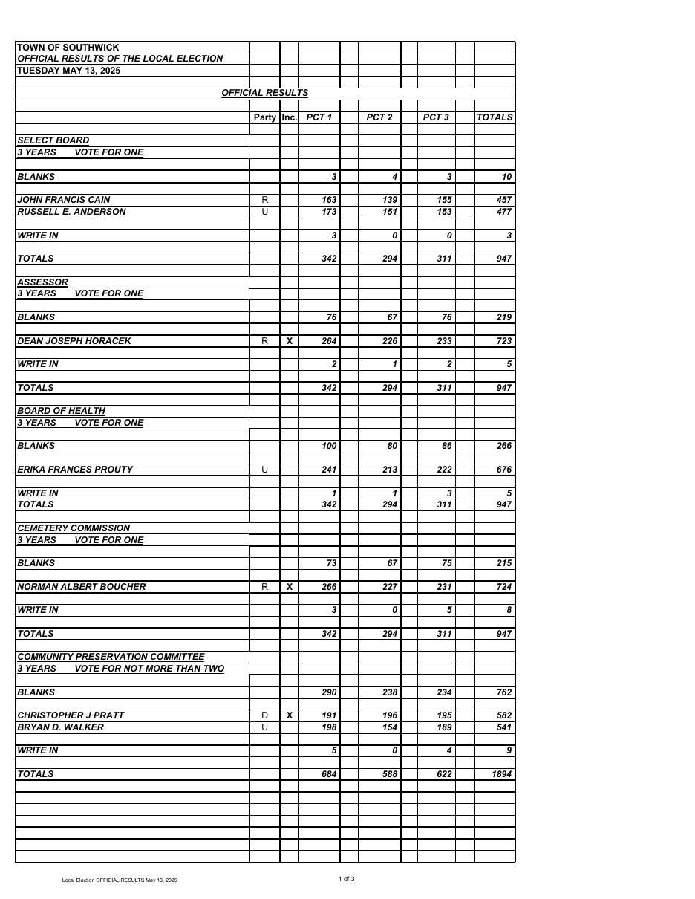
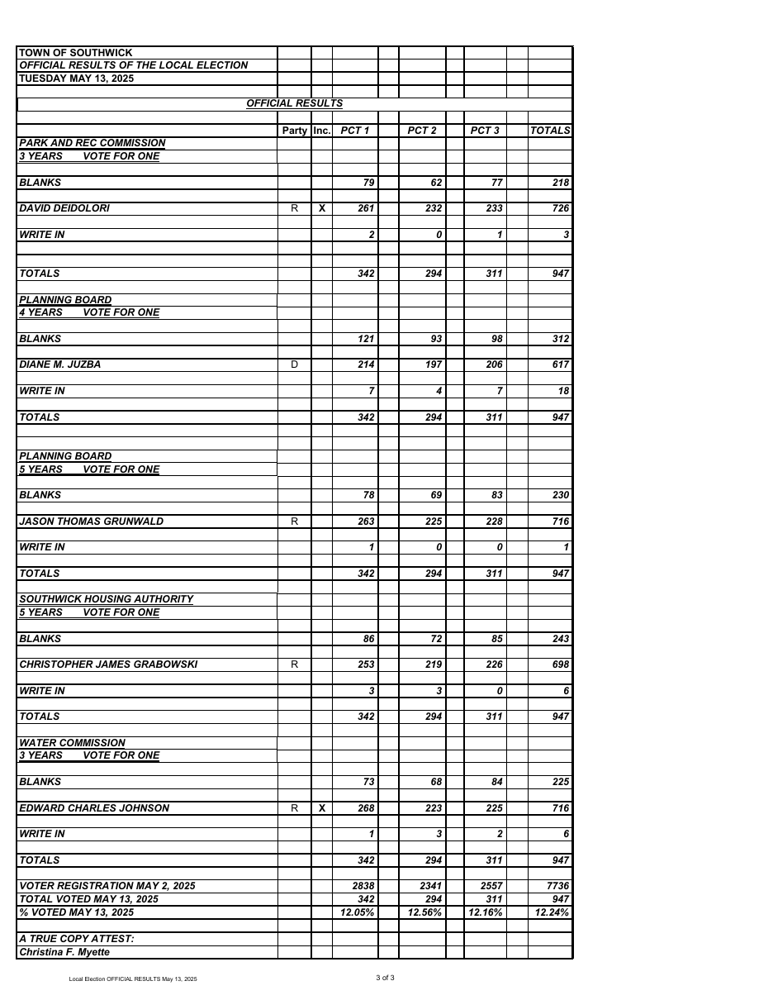
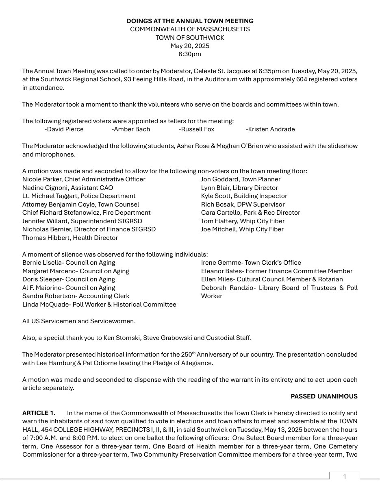
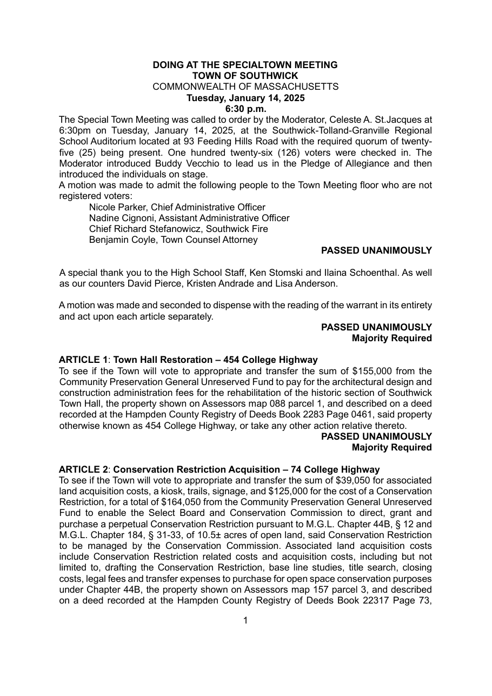

---

## Sturbridge — 9,867 · Worcester · Open Town Meeting · Granicus/Vision

**Election content:** primary store is the **Annual Town Report PDF** (bundles Town Clerk election results + full Town Meeting warrant minutes). Incumbents marked with `*`. **TM attendance is not a headcount** — derived as the max article vote.

| # | Data point | Score | Latest value | Source (2024 Annual Town Report) |
|---|-----------|-------|--------------|--------|
| 1 | Registered/eligible voters | clean | 7,847 (12/31/2024) | [ATR #p63](https://www.sturbridge.gov/sites/g/files/vyhlif12111/f/pages/2024annualtownreportfinal.pdf#page=63) |
| 2 | Local election turnout | clean | 335 = 5% (2024 ATE) | [ATR #p65](https://www.sturbridge.gov/sites/g/files/vyhlif12111/f/pages/2024annualtownreportfinal.pdf#page=65) |
| 3 | State election turnout | clean | 1,238 = 16% (2024 primary) | [ATR #p68](https://www.sturbridge.gov/sites/g/files/vyhlif12111/f/pages/2024annualtownreportfinal.pdf#page=68) |
| 4 | Federal/presidential turnout | clean | 6,046 = 76% (2024) | [ATR #p69](https://www.sturbridge.gov/sites/g/files/vyhlif12111/f/pages/2024annualtownreportfinal.pdf#page=69) |
| 5 | Town Meeting attendance | buried | ≈151 (proxy: peak article vote) | [ATR #p215](https://www.sturbridge.gov/sites/g/files/vyhlif12111/f/pages/2024annualtownreportfinal.pdf#page=215) |
| 6 | Special Town Meeting attendance | buried | ≈91 (proxy) | [ATR #p246](https://www.sturbridge.gov/sites/g/files/vyhlif12111/f/pages/2024annualtownreportfinal.pdf#page=246) |
| 7 | Seats on ballot | clean | ~12 offices (2024) | [ATR #p65](https://www.sturbridge.gov/sites/g/files/vyhlif12111/f/pages/2024annualtownreportfinal.pdf#page=65) |
| 8 | Unopposed / none-running | clean | most seats single-candidate | [ATR #p65](https://www.sturbridge.gov/sites/g/files/vyhlif12111/f/pages/2024annualtownreportfinal.pdf#page=65) |
| 9 | **Incumbents running** | clean | **`*` marks incumbent** | [ATR #p65](https://www.sturbridge.gov/sites/g/files/vyhlif12111/f/pages/2024annualtownreportfinal.pdf#page=65) |
| 10 | Office type + term length | clean | "BOARD OF SELECTMEN / For 3 years / Vote for Two" | [ATR #p65](https://www.sturbridge.gov/sites/g/files/vyhlif12111/f/pages/2024annualtownreportfinal.pdf#page=65) |

⚠️ **Access:** HTML pages 403 to scripts (WAF), but the `/sites/g/files/…/pages/<year>annualtownreport…pdf` assets download freely. Scrape the PDF URLs directly, not the page crawl.

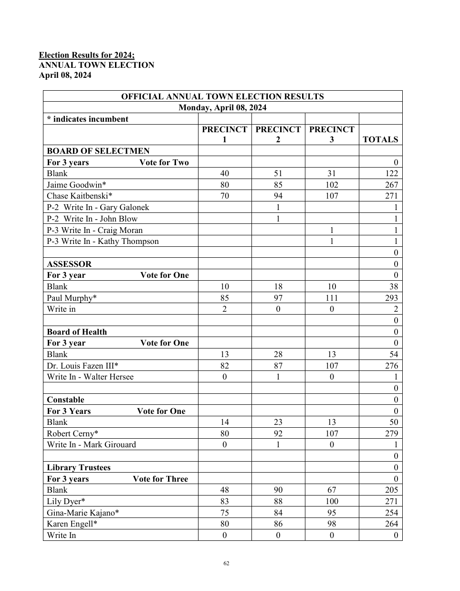
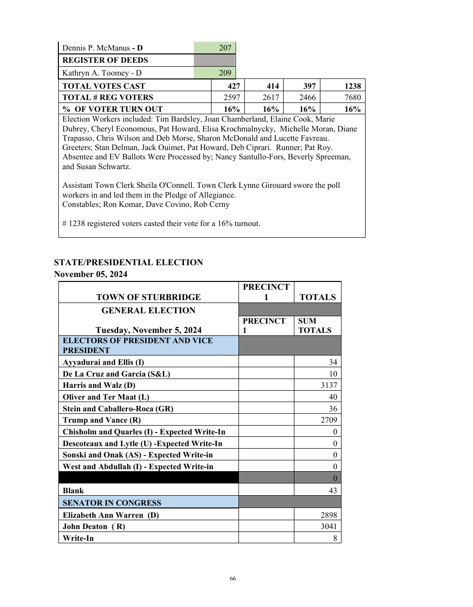
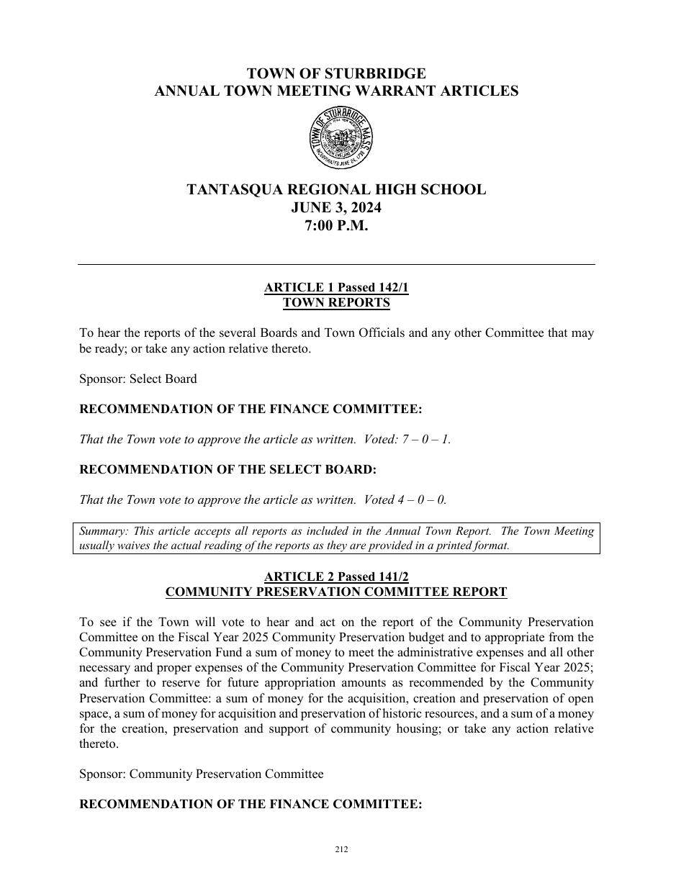
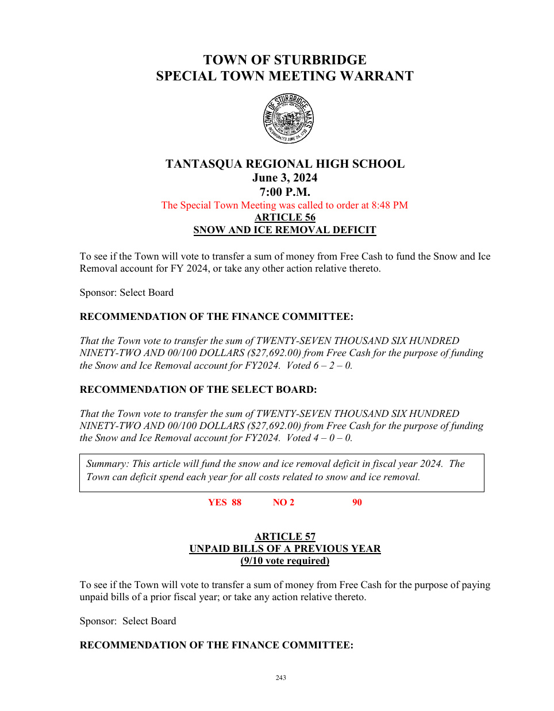

---

## Sutton — 9,357 · Worcester · Open Town Meeting · CivicPlus (scanned)

**Election content:** Town Clerk election results + **Annual Town Report** (bundles election results AND full Town Meeting minutes). **Town-meeting attendance is recorded** ("There were 102 voters and 12 non-voters in attendance"). Everything is a **high-quality scanned-image PDF (0 text layer → needs OCR)**, but legible.

| # | Data point | Score | Latest value | Source |
|---|-----------|-------|--------------|--------|
| 1 | Registered/eligible voters | buried | 7,400 (FY21) | Annual Report p31 (scanned) |
| 2 | Local election turnout | buried | 722 ballots (2022 ATE) | Annual Report p47 |
| 3 | State election turnout | buried | 6,308 ballots (2024) | [Nov 2024 results](https://www.suttonma.org/sites/g/files/vyhlif3901/f/uploads/unofficial_results_nov_5_2024.pdf) |
| 4 | Federal/presidential turnout | buried | Harris 2,851 / Trump 3,233 (2024) | [Nov 2024 results](https://www.suttonma.org/sites/g/files/vyhlif3901/f/uploads/unofficial_results_nov_5_2024.pdf) |
| 5 | **Town Meeting attendance** | buried | **102 voters + 12 non-voters (Spring ATM 2022)** | Annual Report p39 |
| 6 | **Special/Fall Town Meeting attendance** | buried | **67 voters + 16 non-voters (Fall 2021)** | Annual Report p31 |
| 7 | Seats on ballot | buried | 6 seats (2022) | Annual Report p47 |
| 8 | Unopposed / none-running | buried | 3 unopposed (2022) | Annual Report p47 |
| 9 | Incumbents running | none | not marked | cross-ref prior officials |
| 10 | Office type + term length | buried | Select Bd 3yr; Housing 5yr | Annual Report p47 |

⚠️ **Access:** HTML pages are Cloudflare-gated, but the `/sites/g/files/…/uploads/*.pdf` assets are open to curl. The blocker is **OCR** — even the flagship Annual Town Report carries no text layer.

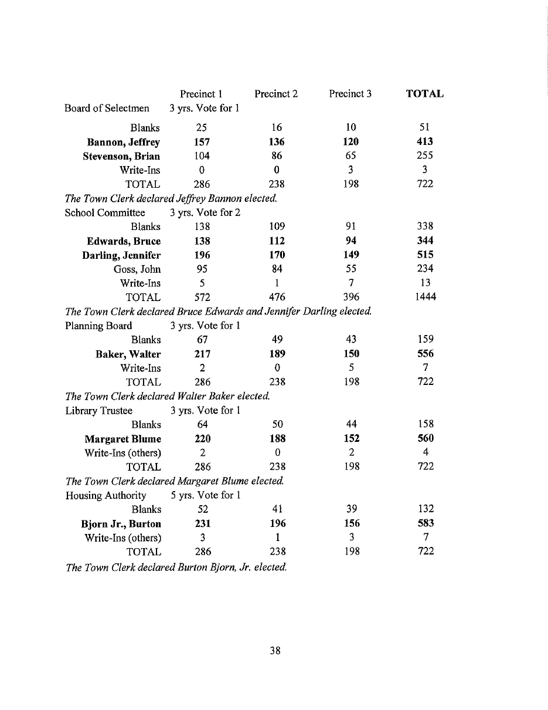
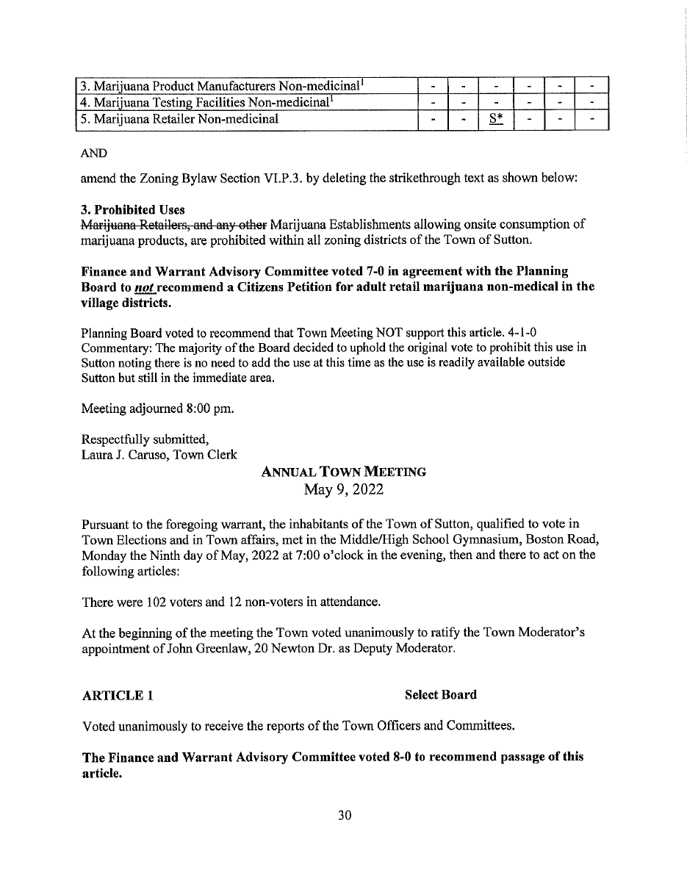
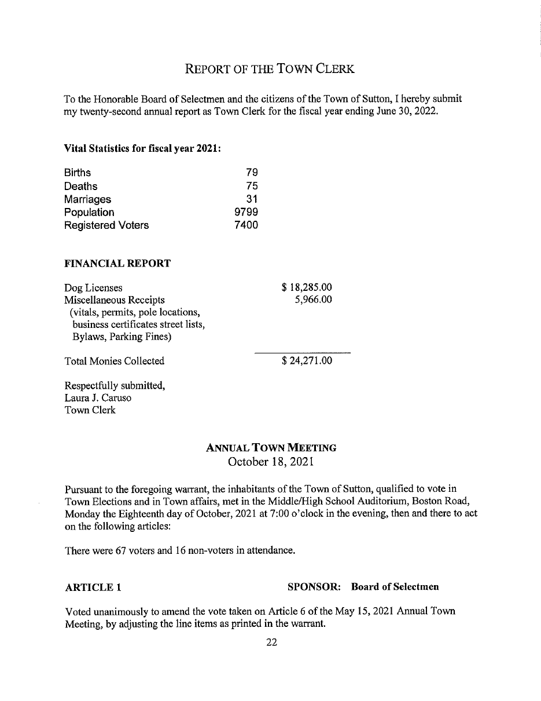
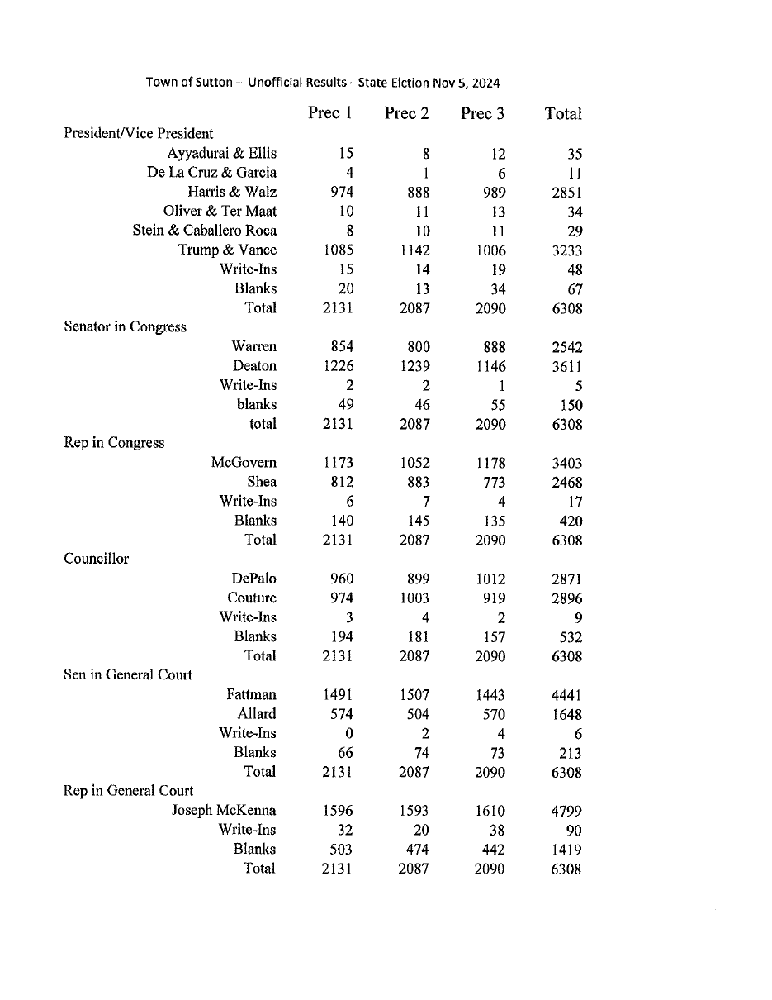

---

## Stockbridge — 2,018 · Berkshire (west) · Open Town Meeting · CivicPlus  🔒 Cloudflare-gated

**Election content:** the **Annual Town Report** series (searchable text) carries nearly every figure inside the "Town Clerk's Report"; standalone election tallies are also posted. **Town-meeting attendance is explicitly recorded** ("213 out of 1676 Registered voters attended"). The whole site sits behind a **Cloudflare challenge**, so automated screenshot capture failed — but the documents open normally in a human browser. Verified live during recon; **open the deep links below to view**.

| # | Data point | Score | Latest value | Source (open in browser) |
|---|-----------|-------|--------------|--------|
| 1 | Registered/eligible voters | clean | 1,676 (2025) | [2025 ATR](https://www.stockbridge-ma.gov/media/20196) |
| 2 | Local election turnout | clean | 462 = 27% (2025) | [2025 ATR](https://www.stockbridge-ma.gov/media/20196) · [2024 tally](https://www.stockbridge-ma.gov/media/13281) |
| 3 | State election turnout | clean | 1,319/1,747 ≈ 76% (2024) | [2024 ATR](https://www.stockbridge-ma.gov/media/16391) |
| 4 | Federal/presidential turnout | clean | 1,319 (Nov 2024) | [2024 ATR](https://www.stockbridge-ma.gov/media/16391) |
| 5 | **Town Meeting attendance** | clean | **213 / 1,676 (2025 ATM)**; 160 (2024) | [2025 ATR](https://www.stockbridge-ma.gov/media/20196) |
| 6 | Special Town Meeting attendance | none | none held 2024–25 | (true absence, not a gap) |
| 7 | Seats on ballot | clean | 10 offices + 2 questions (2024) | [2024 tally](https://www.stockbridge-ma.gov/media/13281) |
| 8 | Unopposed / none-running | clean | Tree Warden = open (no candidate); 7 unopposed | [2024 tally](https://www.stockbridge-ma.gov/media/13281) |
| 9 | Incumbents running | none | not labeled | cross-ref prior roster |
| 10 | Office type + term length | buried | office type yes; term not on ballot doc | [2024 tally](https://www.stockbridge-ma.gov/media/13281) |

🔒 **No screenshot captured** (Cloudflare bot-protection blocks curl + headless Chrome). A production scraper needs a real/automated browser session for Stockbridge-style sites — this gating is itself a feasibility finding.

---

## Becket — 1,931 · Berkshire (west) · Open Town Meeting · CivicPlus  (tiny-town stress test)

**Election content:** the **Annual Town Report** is **born-digital searchable text** (beats the worst-case expectation) and bundles election results + full ATM/STM minutes + the ballot warrant. State/federal result PDFs are only on the Cloudflare-gated index → **use the MA Secretary of the Commonwealth instead**. **Town-meeting headcount is NOT recorded** (only a quorum statement for STM).

| # | Data point | Score | Latest value | Source (2025 Annual Town Report) |
|---|-----------|-------|--------------|--------|
| 1 | Registered/eligible voters | clean | 1,733 (2025) | [ATR #p39](https://www.townofbecket.org/sites/g/files/vyhlif4146/f/uploads/becket_digital_2025_annual_town_report.pdf#page=39) |
| 2 | Local election turnout | clean | 233 = 13.6% (2025) | [ATR #p64](https://www.townofbecket.org/sites/g/files/vyhlif4146/f/uploads/becket_digital_2025_annual_town_report.pdf#page=64) |
| 3 | State election turnout | buried | gated on town site | **→ MA SoC** electionstats |
| 4 | Federal/presidential turnout | buried | gated on town site | **→ MA SoC** electionstats |
| 5 | Town Meeting attendance | none | **not quantified** (open ATM, no headcount) | [ATR #p40](https://www.townofbecket.org/sites/g/files/vyhlif4146/f/uploads/becket_digital_2025_annual_town_report.pdf#page=40) |
| 6 | Special Town Meeting attendance | buried | quorum-only ("20 registered voters… we had") | [ATR #p58](https://www.townofbecket.org/sites/g/files/vyhlif4146/f/uploads/becket_digital_2025_annual_town_report.pdf#page=58) |
| 7 | Seats on ballot | clean | 6 seats / 5 offices (2025) | [ATR #p57](https://www.townofbecket.org/sites/g/files/vyhlif4146/f/uploads/becket_digital_2025_annual_town_report.pdf#page=57) |
| 8 | Unopposed / none-running | clean | Select Bd & Planning contested; 3 unopposed | [ATR #p64](https://www.townofbecket.org/sites/g/files/vyhlif4146/f/uploads/becket_digital_2025_annual_town_report.pdf#page=64) |
| 9 | Incumbents running | buried | not labeled | cross-ref roster / press |
| 10 | Office type + term length | clean | Select Bd 3yr; Planning 5yr — printed in warrant | [ATR #p57](https://www.townofbecket.org/sites/g/files/vyhlif4146/f/uploads/becket_digital_2025_annual_town_report.pdf#page=57) |

⚠️ **Access:** HTML index is Cloudflare-gated; direct `/sites/g/files/…/uploads/*.pdf` assets are open. State/federal turnout: get from the **MA SoC** central source, not the town site.

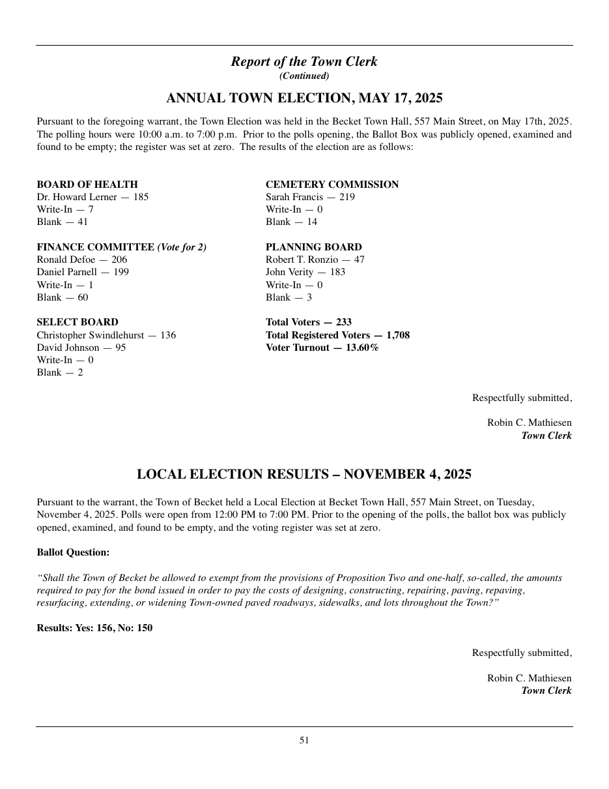
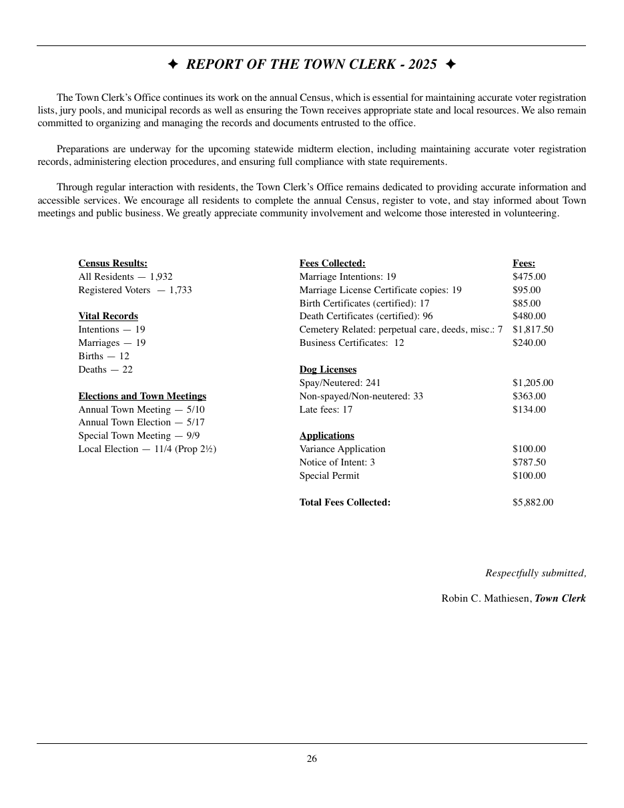
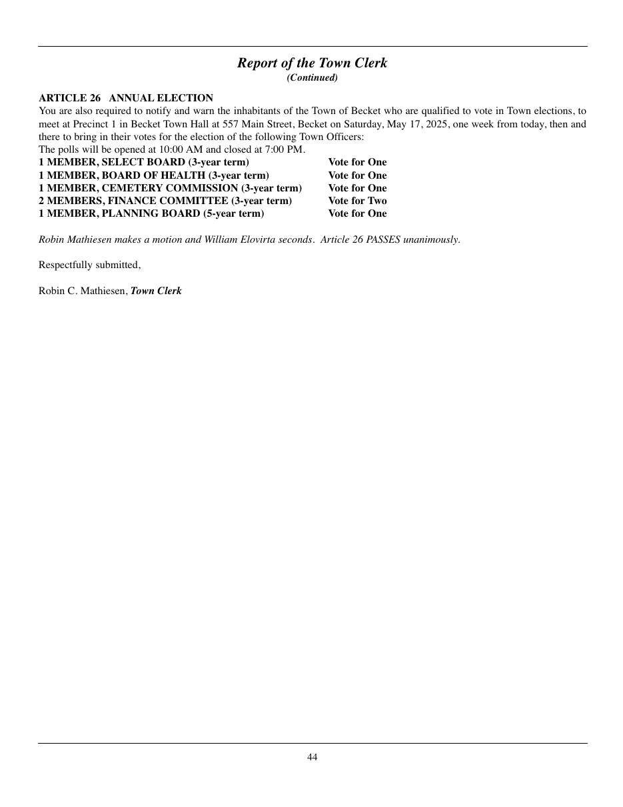
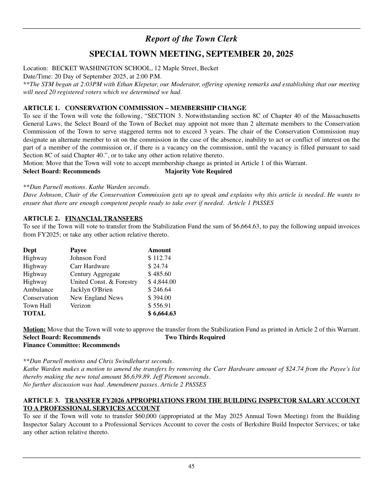

---

## The state-level shortcut (applies to every municipality)

For **registered voters, state results, federal/presidential results, and state-legislative results**, the **MA Secretary of the Commonwealth** publishes everything **by municipality** centrally — so these fields don't require scraping 351 town sites at all:

- **electionstats.state.ma.us** — state/federal/state-legislative results, **downloadable CSV per election by municipality (and precinct)**, 1970→present, via the URL pattern `/elections/download/{electionID}/precincts_include:0/`.
- **sec.state.ma.us** Registration/Enrollment Statistics — registered voters + party enrollment **by municipality** (selectable-text PDF), back to ~2004.

What genuinely requires per-municipality scraping is only: **local election results, ballot-level detail (seats/unopposed/incumbents/terms), and town-meeting turnout.**
